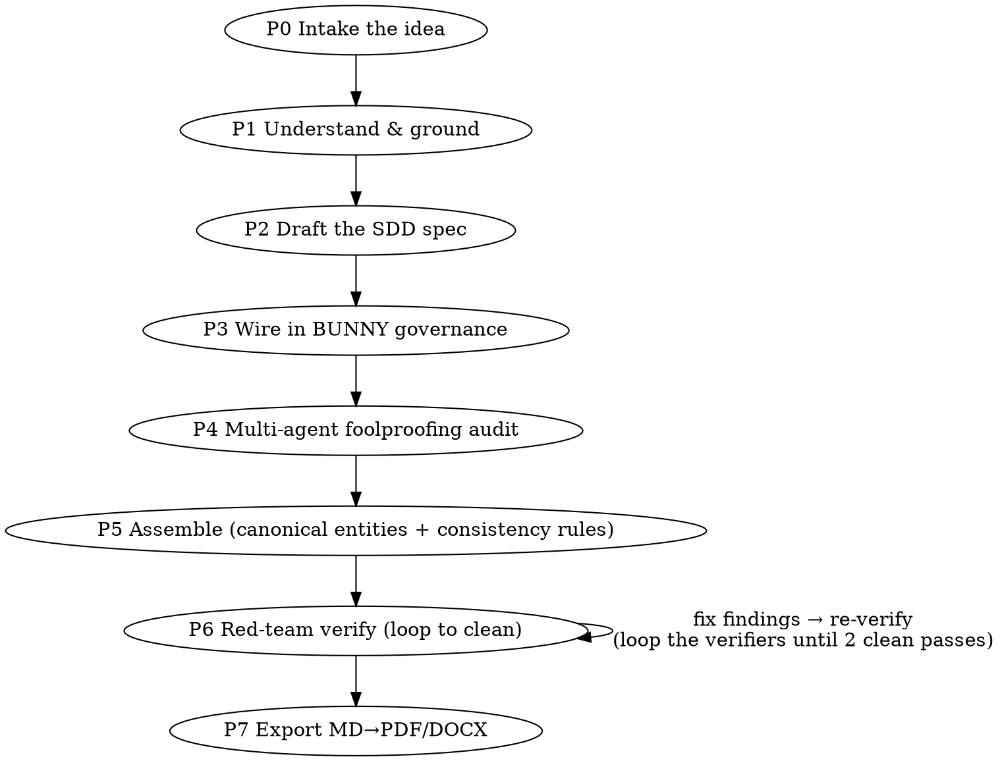

# forge-prd — turn an idea into a foolproof, spec-driven PRD

## What this skill is

A repeatable process for producing a PRD to a *very high* bar: the standard of the
**Agent Atelier PRD** (2,755 lines / 64 pp), which is vendored here as the gold-standard
reference output (`reference-output/EXEMPLAR-PRD.md`). The output is not a sketch — it is
a document complete and unambiguous enough that a spec-driven builder (e.g. Antigravity)
can regenerate the code from it without inventing behaviour.

**The one-line job:** given an idea/concept, produce a PRD that is (a) **Spec-Driven** (the
spec is the product; code regenerates from it), (b) **product-agnostic** (everything
specific → config, resolved via a `[[VARIABLE]]`-style resolver), (c) **grounded** in the
relevant frameworks (for agentic products, the 5 course whitepapers), (d) built under the
**BUNNY** governance harness with **tests-first per-phase gates**, and (e) **adversarially
foolproofed and red-teamed** until clean — then **exported** to MD/PDF/DOCX.

**The core belief (say it to the user):** *the planning stage is the most important stage;
the spec is the product.* Any quirk left unspecified becomes a bug the builder invents. So
we over-invest here, on purpose.

## How to read this skill (progressive disclosure — a Day-3 principle applied to itself)

The SKILL.md you are reading is L2: the workflow spine and the routing table. The depth
lives in L3 reference files you load **on demand, per phase** — do not read them all up
front:

| When you are in… | Read this reference | For… |
|---|---|---|
| any phase (orientation) | `references/methodology.md` | the full P0–P7 process with concrete sub-steps |
| P2 (drafting) | `references/sdd-skeleton.md` | the canonical section-by-section PRD template |
| P3 (governance) | `references/bunny-governance.md` | the 10-field prompt-contract, validator/executor/authorizer split, tests-first gate, ON-FAIL disciplines |
| P1–P4 (agentic products) | `references/whitepaper-map.md` | the 5-day concept map to weave in + the Appendix-B rubric pattern |
| P4–P6 (review pipeline) | `references/workflow-patterns.md` | the multi-agent foolproofing / assembly / red-team orchestration DNA + schemas |
| throughout | `references/gotchas.md` | the hard-won rules — read these once at the start; they prevent the expensive mistakes |
| P4–P7 (tooling) | `scripts/` | the deterministic splicer + the MD→PDF/DOCX export pipeline |

The gold-standard **exemplar** (`reference-output/EXEMPLAR-PRD.md`) and the **BUNNY source
files** (`reference-output/bunny-method/`) are vendored so the skill is self-contained.
Study the exemplar for *quality, structure, density, and voice* — but **never copy its
domain content** into a new PRD; it is an agentic-marketing product, and yours may be
anything.

## The workflow (P0 → P7)

Run these in order. Read `references/gotchas.md` first, then walk the phases. Full detail
for each phase is in `references/methodology.md` — this is the spine.

> **Note on "P" numbering:** P0–P7 here are the *forge authoring* phases. They are distinct
> from the produced PRD's own build roadmap (skeleton §19 / BUNNY), whose gated contracts carry
> their *own* independent phase numbers (P0–P6 in the exemplar). Don't conflate forge-P4
> (foolproofing) with a build contract "P4".

**P0 — Intake the idea (conversational, one focus at a time).** Elicit: what the thing is;
the real-world source system if you are generalizing one; the target build platform/stack;
who the user is; the **product-agnostic goal** ("the *studio* is constant; the *X* is
configuration"); hard constraints and non-goals; and whether it is an agentic/AI system
(this decides how much of the whitepaper concept-map applies). **Confirm the product NAME
early — it anchors everything.** Do not fan out or draft until you and the user agree on
scope. If the idea spans several independent subsystems, help decompose first and forge the
first sub-PRD.

**P1 — Understand & ground.** If generalizing an existing system, reverse-engineer it (read
its code/docs/UI). Read the relevant framework sources — **for agentic products, read the
actual whitepaper for each relevant day** (`references/whitepaper-map.md` has the vault
paths); do not rely on model memory for concept fidelity. Produce a structured map of the
source + the concepts that will apply.

**P2 — Draft the SDD spec** using the canonical skeleton in `references/sdd-skeleton.md`.
**Product-agnostic discipline is absolute:** every specific fact becomes a config field;
NEVER hard-code the worked example's config *values* into the generic spec (run the scoped
leak-check in `references/gotchas.md` §3 before you ship — naming the source system in §1/§2 is
fine; a config value in the generic body is the leak). Author the supporting artifacts *alongside* the spec (agent/role
templates, canon/engine docs, policies, schema, a golden set) — instruction/rule files are
source code (a Day-4 principle), not something to defer to regeneration.

**P3 — Wire in the BUNNY build governance** (`references/bunny-governance.md`): the harness
that makes the build executable, gated, and honest — the 10-field prompt-contracts, the
validator/executor/authorizer separation, lock-and-proceed, the **tests-first per-phase
gate** (each phase's acceptance Gherkin becomes an executable test suite authored *before*
its code; the phase gate is a green suite, not a judgment call), the conscious-deviation
log, and the ON-FAIL / grounding disciplines.

**P4 — Multi-agent foolproofing audit** (`references/workflow-patterns.md`). Fan out
adversarial auditors, one per robustness dimension, plus a small design panel for the most
important new experience. Each reads the spec + the relevant whitepaper and returns a
structured change-set. Consolidate into a deduped, section-keyed change-set + a
**course-coverage scorecard** (concept → strong/partial/missing → planned addition → where;
scorecard for agentic/course products only). Run this with the `Workflow` tool if you have it,
or **inline with parallel subagent (`Task`) calls (the default)** — `references/workflow-patterns.md`
gives both the workflow scripts and the inline recipe.

**P5 — Assemble** the findings into the spec. Cluster changes by target section; give each
cluster ONE agent, the **canonical entity set** (exact field names of every shared entity,
so clusters reference rather than redefine) and an explicit **numbered consistency-rules**
list. Apply the ready-to-splice blocks with the **deterministic splicer**
(`scripts/splice.py`): unescape → dry-run assert every anchor matches exactly once → apply
from a pristine copy (idempotent) → report.

**P6 — Red-team verification** (`references/workflow-patterns.md`). Independent verifier
slices hunt contradictions, broken cross-refs, rule violations, and residual gaps **at the
seams**. **Fix every finding; loop until two consecutive clean passes** — the second pass
catches defects the first pass's fixes introduced. No compromise. (This is the same
adversarial-verify discipline you should apply to *this skill's own output*.)

**P7 — Export** (`scripts/export.sh` — macOS; on Linux run `build_html.py` then a
headless-Chrome / weasyprint equivalent): MD → HTML (Python `markdown`) → PDF (Chrome
headless) + DOCX (`textutil`). The script **fails closed** on the two render-critical checks
(balanced code fences, zero stray HTML entities); it also reports page count and lists sections
for a human contiguity spot-check, then reminds you to eyeball the PDF for ASCII-diagram
alignment.

## Hard rules (the non-negotiables — details in `references/gotchas.md`)

1. **The spec is the product.** Over-specify. Every undefined enum, race, or edge case is a
   bug the builder will invent. Foolproofing is not gold-plating; it is the job.
2. **Product-agnostic or it fails.** No domain config *values* in the generic mechanism. Run
   the scoped leak-check (`references/gotchas.md` §3 — it excludes Appendix A onward; run it on
   `PRD.md` only) before shipping. The source-system *name* in §1/§2 is expected; a config
   value (an offering, a forbidden-claim string, a voice phrase) in §0/§3–§20 is the leak.
3. **Safety fails closed.** Safety-critical config (forbidden claims, non-disclosure rules,
   required framing) blocks when empty/unconfirmed. Secrets resolve only into the tool/MCP
   auth layer, never into model-visible prompts. Human edits re-run the deterministic gates
   — no bypass.
4. **Ground in live sources, not memory.** Read the actual whitepaper/framework docs. Treat
   model IDs and external API limits as "confirm against live docs at build time" — same-cutoff
   review panels share blind spots, so always scope one lens to currency & completeness.
5. **Durable over ephemeral.** Externalize knowledge into files (the spec, briefs, memory),
   never the conversation. Compaction is lossy; disk is not.
6. **Loop the red-team to clean.** Two consecutive clean passes, or you are not done.
7. **Deterministic gates over vibes.** Where a check can be made observable (a test, a
   linter, a schema), make it the hard gate; keep the LLM-judge advisory.

## Deliverables at the end

Create these in the user's project / current working directory (confirm the exact location
during P0 intake); the splicer and export scripts then operate on those paths.

- `PRD-<name>.md` — the spec (the product), at the exemplar's bar.
- `PRD-<name>.{pdf,docx}` — exported, render-verified.
- The `/specs` + config artifact set authored alongside (roles, canon, policies, schema,
  golden set) — see `references/sdd-skeleton.md` Appendix D.
- A course-coverage scorecard (Appendix B) if the product is agentic.
- A short design brief capturing anything learned that is worth carrying forward (the
  durable-over-ephemeral rule).

## Announce it

When you start, tell the user: *"Using forge-prd to take this from idea to a foolproof,
spec-driven PRD — I'll intake the concept, ground it, draft the spec, wire in build
governance, then run a multi-agent foolproofing + red-team pass before exporting."* Then
begin P0.
